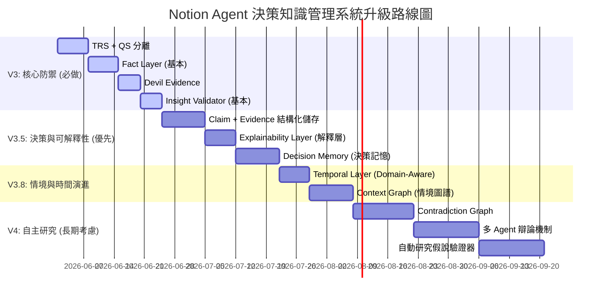

# Notion Agent V3 & V3.5 決策知識管理體系 (DKMS)：架構演進與設計藍圖

針對當前 RAG 知識彙整系統從「知識管理 (KM)」邁向「知識研究 (KR)」，最終演進至「決策知識管理 (DKM, Decision Knowledge Management)」階段所面臨的關鍵盲點，本文件定義了 V3 到 V3.8 智能助理系統的架構設計方案與研發路線圖。

---

## 🗺️ 架構演進對比 (KM -> KR -> DKM)

```mermaid
graph TD
    subgraph V2: 知識管理階段 (KM - 文字摘要)
        V2_Source[Notion 筆記] --> V2_Clust[語意聚類]
        V2_Clust --> V2_Synth[LLM 混合 RAG 合成]
        V2_Synth --> V2_Doc[專題文章]
    end

    subgraph V3 & V3.5: 決策知識研究階段 (DKM - 事實/解釋/決策閉環)
        V3_Source[Notion 筆記] --> V3_Temp[領域自適應時間層 Domain-Aware Temporal]
        V3_Temp --> V3_Clust[語意聚類 & TRS+QS 評估]
        V3_Clust --> V3_Fact[事實與血統追溯層 Fact Layer with Lineage]
        
        V3_Fact --> V3_Context[情境脈絡圖譜 Context Graph]
        V3_Fact --> V3_Disproof[非對稱反證 Devil's Evidence]
        
        V3_Context --> V3_Synth[事實與證據組裝合成]
        V3_Disproof --> V3_Synth
        
        V3_Synth --> V3_Explain[可解釋性層 Explainability Layer]
        V3_Explain --> V3_Eval[雙軌新洞察驗證器 Insight Validator]
        
        V3_Eval --> V3_Decision[決策記憶與失效觸發器 Decision Memory]
        V3_Decision --> V3_Doc[Synthesis / Hypothesis 專題]
    end
```

---

## 1. 檢索與排序優化：TRS/QS 分離與領域自適應時間衰減 (Domain-Aware Temporal Layer)

* **痛點**：
  1. **無關高分文獻排擠**：高品質但與特定主題無關的文章會排擠低分但高度相關的文章。
  2. **時間失效性 (Temporal Blindness) 與領域一刀切**：時間衰減（例如近期文獻優先）在 AI 領域高度適用，但在心理學、哲學、管理學（如《高效能人士的七個習慣》）等領域，經典文獻的價值歷久彌新。一刀切的時間衰減會導致系統「自動歧視經典文獻」。
* **V3.8 設計**：
  * **語意搜尋優先**：以 **Embedding Similarity (向量語意搜尋)** 作為第一召回，Keyword Search 降為備援。
  * **領域自適應時間衰減 (Domain-Aware Decay)**：引入 `Domain Tag` (領域標籤) 與 `freshness_score` (新鮮度分數)。
    $$\text{freshness\_score} = e^{-\lambda \cdot t}$$
    *其中 $t$ 為當前時間與文獻發表時間的差距（以年為單位），$\lambda$ 為根據領域動態調整的衰減係數：*
    
    | 知識領域 (Domain) | 衰減係數 ($\lambda$) | 衰減速度 | 說明 |
    | :--- | :---: | :---: | :--- |
    | **AI / LLM** | `0.80` | 極快 | 技術日新月異，2 年前的文章參考價值極低 |
    | **Software Eng** | `0.50` | 快 | 框架更迭頻繁，但底層設計模式相對穩定 |
    | **Business Mode** | `0.30` | 中 | 商業策略與市場模式具備數年生命週期 |
    | **Management** | `0.05` | 極慢 | 組織與管理學經典理論具備長期穩定價值 |
    | **Philosophy / Psych** | `0.00` | 無衰減 | 哲學與心理學經典著述永不過時 |

  * **最終加權排序分數 (Final Score)**：
    $$\text{Final Score} = (0.7 \times TRS + 0.3 \times QS) \times \text{freshness\_score}$$

---

## 2. 事實提取層與資料血統追溯 (Fact Layer with Data Lineage)

* **痛點**：文字直推文字（Text-to-Text）會導致 AI 在提煉事實時產生「過度泛化」（例如將原文「某公司導入 Agent 後效率提升」泛化為事實「Agent 可提升企業效率」），在後續推論中誤差被無限放大。此外，隨資料庫規模擴大，無法快速追溯某個 Claim 的精確原始出處。
* **V3.5 設計**：將 Fact Layer 升級為「事實 + 證據 + 類型 + 物理血統」的結構化 Claim Pool。
  * **做法**：對每篇核心文獻，先提煉為包含原文精確引用與位置的結構化 JSON（Claim Pool）。
  ```json
  [
    {
      "claim": "基於工作流的 Agent 在特定垂直領域效率表現優於通用 RAG",
      "evidence_quote": "原文第 3 段：在法律 RAG 測試集中，導入 Workflow 結構後，準確度由 Llama 預設的 60% 提升至 85%",
      "evidence_type": "fact", 
      "confidence": 0.92,
      "source_id": "Notion_Page_UUID_1",
      "source_date": "2025-06-01",
      "provenance": {
        "paragraph_id": "p_08328",
        "chunk_id": "c_29a74",
        "offset_range": [128, 256],
        "anchor_text": "在法律 RAG 測試集中...提升至 85%"
      }
    }
  ]
  ```
  * **證據類型 (evidence_type)** 強制分類為：`fact` (客觀事實)、`opinion` (作者觀點)、`speculation` (作者推測)。
  * **資料血統 (Data Lineage)**：藉由記錄 `provenance`，系統可實現「Claim -> Chunk -> Notion 原始段落」的三級血統追溯，供用戶隨時點擊回溯驗證。

---

## 3. 複雜度防禦：系統可解釋性層 (Explainability Layer)

* **痛點**：隨著 TRS, QS, Temporal Layer, Fact Layer, Validator 等 8 層架構層疊加，系統會淪為無法 debug 的「黑盒子」，使用者無法理解為什麼某篇文章最終被選中或被淘汰。
* **V3.5 設計**：
  * 在每篇生成的專題文章底層 metadata 中，自動生成並附帶 **可解釋性報告 (Explainability Report)**。
  ```json
  {
    "explainability_report": {
      "selected_articles": [
        {
          "title": "LangGraph 多智能體架構實踐",
          "trs": 0.88,
          "qs": 0.71,
          "freshness": 0.95,
          "final_score": 0.84
        }
      ],
      "rejected_articles": [
        {
          "title": "Docker 2023 最佳實踐",
          "trs": 0.12,
          "reason_code": "LOW_RELEVANCE"
        },
        {
          "title": "LangChain 2023 舊版指南",
          "trs": 0.85,
          "freshness": 0.15,
          "reason_code": "EXPIRED"
        }
      ]
    }
  }
  ```
  * **可追溯的 AI 推理**：藉此讓用戶清楚洞悉「AI 為什麼這樣選」，而不是盲信 AI 的主觀推薦。

---

## 4. 決策記憶與失效提醒觸發器 (Decision Memory)

* **痛點**：知識的真正價值不在於被整理，而在於「影響未來的決策」。當前系統僅在生成文章，無法在架構或技術決策背景假設失效時（如團隊規模擴大），主動提醒用戶重新審視當初的決策。
* **V3.5 設計**：
  * 在專題文章與 Notion 任務庫中建立 **Decision Memory（決策記憶）** 區塊，用以結構化記錄技術決策的權衡背景：
  ```json
  {
    "decision": "選擇 n8n 作為自動化工作流引擎，放棄 LangGraph",
    "because": [
      "低維護與營運成本",
      "部署簡單且直觀",
      "當前團隊非工程背景為主"
    ],
    "revisit_triggers": {
      "team_size_exceeds": 5,
      "workflow_count_exceeds": 50,
      "time_interval_days": 180
    }
  }
  ```
  * **失效提醒 (Decision Expiration)**：背景任務會定期與 Notion 團隊及專案資料庫進行核對，當觸發器條件滿足（例如團隊人數突破 5 人）時，系統將在 Notion 任務資料庫中自動建立一筆「重啟評估決策：當初選擇 n8n 的假設已失效，是否重新評估 LangGraph？」的提醒，實現決策閉環。

---

## 5. 情境脈絡圖譜 (Context Graph)

* **痛點**：觀點的對立往往不是是非對錯的問題，而是「適用情境（如團隊規模、技術棧、專案大小）的差異」。一味判定矛盾或整合會丟失情境脈絡。
* **V3.8 設計**：
  * 從「矛盾圖譜 (Contradiction Graph)」升級為 **「情境脈絡圖譜 (Context Graph)」**。
  * **做法**：在 Fact 提取時，強制提取 Claim 所在的背景情境變數（如 `team_size`, `project_scale`, `tech_stack`）。
  * **輸出對照**：當系統發現兩篇文獻的結論不同時，輸出 **`【情境差異對比】`**（例如：「文獻 A 在小團隊個人專案情境下推薦 n8n；而文獻 B 在企業級高併發系統下建議 LangGraph」），分析其適用邊界。

---

## 6. 雙軌新洞察驗證器 (Synthesis vs. Hypothesis)

* **痛點**：防止 Validator 鼓勵 AI 進行邏輯大躍進的「漂亮胡說」。
* **V3.5 設計**：
  * 將 Validator 驗證通過的洞察拆分為 **雙軌輸出**，並在正文中明確標註：
    * `【跨文獻綜合發現 (Synthesis)】`：多篇文獻客觀事實交叉印證後歸納出的客觀新觀點。
    * `【研究假說 (Hypothesis)】`：基於文獻事實，經 AI 邏輯外推後得出、但尚未被本地文獻完全證實的合理推測。
  * **硬性門檻**：如果一篇文章中既沒有 `Synthesis` 也沒有 `Hypothesis`，則直接降級為「基礎摘要」，不予生成專題文章。

---

## 🚀 Notion Agent 研發路線圖 (Roadmap)



* **V3 階段（核心防禦）**：TRS/QS 分流、基礎 Fact Layer、惡魔代言人與新洞察驗證，解決幻覺與不相關檢索問題。
* **V3.5 階段（決策與解釋性）**：著重於可解釋性報告（為什麼選這篇）、資料血統追溯以及最關鍵的 **Decision Memory (決策記憶與失效提醒)**，讓系統具備引導與修正未來決策的能力。
* **V3.8 階段（情境與時間演進）**：引入領域自適應時間衰減（避免歧視經典文獻）與 Context Graph（探討情境差異而非一味判斷對錯），讓系統具備深度的脈絡分析能力。
* **V4 階段（自主研究）**：探索 Contradiction Graph 矛盾對比、多 Agent 自主辯論與研究假說的自動驗證機制。
