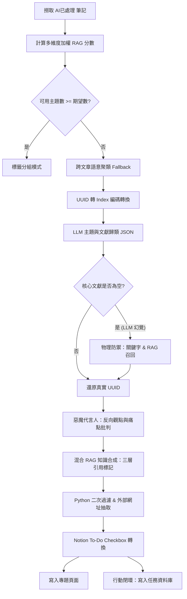

# Notion Agent 知識彙整與專題撰寫策略架構
本文件詳細說明多主題 RAG 彙整器 ([synthesize_knowledge.py](file:///c:/Users/etrny/.gemini/antigravity/scratch/Notion_agent/synthesize_knowledge.py)) 的底層設計策略、寫作邏輯與技術框架。

---

## 🗺️ 全景架構圖

下圖展示了從 Notion 資料來源撈取筆記，經過過濾、聚類、思辨、合成、Guardrails 二次驗證，到最終寫回專題資料庫與任務資料庫的完整生命週期：

---

## 1. 資料預處理與加權 RAG 分數 (Data Preprocessing)

在從來源資料庫撈取已處理文章後，系統對每篇文章計算其 **RAG Score**。這個分數用來在文獻彙整時決定哪些文章應作為「核心文獻」（提供全文），哪些作為「輔助文獻」（提供摘要）。

### 🔢 RAG Score 計算公式

$$\text{RAG Score} = 0.4 \times \text{Credibility} + 0.3 \times \text{Actionability} + 0.3 \times \text{Inspiration}$$

* **可信度 (Credibility, 1-10)**：反映文章的客觀真實與可靠度。
* **可執行性 (Actionability, 1-10)**：反映文章內含代碼、架構或步驟的具體度。
* **主觀啟發 (Inspiration, 5 或 10)**：若文章被標記為「深受啟發」，則獲得滿分 10 分，否則為 5 分。

---

## 2. 語意聚類與 ID 匹配安全防禦 (Semantic Clustering & Fallback)

當標準標籤不足時，系統啟動「跨文章語意聚類」機制，尋找跨文獻的交叉研究專題。

### 🏷️ UUID 轉 Index 的防幻覺編碼
Notion 的 UUID 較長且包含連字符（如 `06d38af4-6d06-4ad6-a4c6-831809c908fa`），大語言模型（LLM）在生成 JSON 列表時極易發生拼寫錯誤或抄襲佔位符，導致代碼無法在資料字典中匹配到真實文章。
* **做法**：Python 在調用 LLM 進行聚類前，將所有文章的 UUID 轉換為簡單的整數索引（如 `"0"`, `"1"`, ...）。
* **LLM 回傳**：LLM 僅需回傳 `core_article_indices: ["0", "1"]`，大幅降低 token 浪費並保證 100% 的 JSON 解析穩定度。
* **解碼**：Python 接收到結果後，透過內部對照表將索引還原為原始 UUID。

### 🛡️ 物理防禦召回 (Fallback Retrieval)
為防範極端情況下 LLM 回傳了無效的 JSON 索引，Python 實作了物理防禦機制。如果匹配出的 `core_candidates` 長度為 0，則根據 LLM 產出的主題名稱進行**加權關鍵字召回**：
1. **關鍵字命中**：提取主題名稱中的主要中文词组，若文章標題包含該詞組加 10 分，摘要包含加 3 分。
2. **結合 RAG Score**：將匹配得分加上文章的原始 RAG 分數。
3. **召回**：挑選得分最高的前 2 篇作為核心文獻，確保文章正文 100% 具備真實的參考上下文。

---

## 3. 正反思辨與惡魔代言人 (Devil's Advocate)

為了讓專題文章具備深度批判性，而非流於表面的科普吹捧，系統在撰寫正文前會單獨呼叫 LLM 扮演**惡魔代言人**：
* **輸入**：核心文獻全文與輔助文獻摘要。
* **輸出**：
  1. 針對該技術/方法的主流質疑。
  2. 業界經典失敗案例或落地痛點（如過度工程化、維護成本陡峭）。
  3. 「絕對不該使用」此方法或技術的特定情境。
* **整合**：該批判分析將作為 Context 輸入給正文寫作 LLM，並在文章中以 `#### 反向觀點與不適用情境` 專節展現。

---

## 4. 三層引用標記與自動化網址抽取 (Citation Strategy)

為保證知識產出不空想、有依據，文章正文實施嚴格的**三層引用標記規範**：

| 引用類別 | 標註格式 | 網址處理方式 | 說明 |
| :--- | :--- | :--- | :--- |
| **資料庫文獻** | `[資料庫文獻 X]` | 自動同步 Notion 資料庫網址 | 來自使用者自己的「網路文章影片筆記資料庫」的內容。 |
| **外部具體文獻** | `[外部文獻: 標題](網址)` | Python 自動抽取並加入文末 | AI 主動引入的外部高價值文章、部落格或論文。 |
| **AI 邏輯推理** | `[AI推理/延伸分析]` | 無 | AI 基於通用常識做出的延伸技術推論。 |

### 🛠️ Python 自動化引用過濾與 URL 注入 (Guardrail)
1. **編號校驗**：防止 LLM 幻覺出不存在的文獻編號（如只提供 2 篇卻標記 `[資料庫文獻 5]`），Python 會自動濾除超標引用。
2. **外部網址抽取**：Python 會使用正則表達式 `\[外部文獻:\s*([^\]]+)\]\((https?://[^\s\)]+)\)` 自動掃描正文。
   * 將其在正文中的標記簡化替換為 `[外部文獻 Y]`。
   * 將其標題與 URL 提取出來，合併至文章末尾的「參考文獻」列表中。
3. **文末文獻注入**：Python 會物理截斷 LLM 自行生成的 Reference 區塊，改由代碼讀取真實的 `[資料庫文獻]` 超連結與 `[外部文獻]` 清單，統一在文章最末端格式化輸出。

---

## 5. 行動閉環與 Notion 區塊轉換 (Action Items Synchronization)

專題文章最後必須包含 `#### 下一步行動計畫 (Action Items)`，且必須符合個人可落地執行的具體指引。

### 🔄 Notion To-Do Checkbox 轉換
在 Markdown 中，LLM 輸出的任務列表格式為 `- [ ] 任務名稱`。
* **原本缺陷**：被直接轉為 Bulleted List Item，在 Notion 中顯示為 `[ ]` 純文字，無法進行勾選。
* **修正**：在 `markdown_to_notion_blocks` 中，透過正則表達式識別 `- [ ] ` 開頭的行，將其轉換為 Notion 原生的 `to_do` 區塊，賦予其可互動的 Checkbox 屬性。

### 🎯 任務資料庫關聯 (Action Items Synchronization)
在頁面成功寫入後，系統會自動解析行動計畫文字，清除其中的參考標註，並在 Notion **任務資料庫**中建立一筆「未開始」的任務，同時利用 `relation` 屬性將其關聯至該篇專題文章，形成完美的知識到行動的閉環。

---

## 🚀 邁向下一代 V3 & V3.5 決策知識管理體系 (DKMS)

本文件說明的是 V2 知識管理階段 (KM) 的現行寫作策略。針對最新的專家評審與架構審查意見，V3 & V3.5 系統將從「知識管理」演進至「決策知識管理 (Decision Knowledge Management)」架構，包含以下核心改造點：
* **資料血統與事實防污染**：事實提取層 (Fact Layer) 引入 `evidence_quote` 與 `provenance` 血統追溯，正文生成器只能自 Claim Pool 取料。
* **可解釋性層 (Explainability Layer)**：每篇專題自動附帶選擇與淘汰文獻原因的報告，防止複雜度黑箱。
* **決策記憶與失效提醒 (Decision Memory)**：結構化記錄決策與其背景假設，並在假設失效（如團隊擴大）時主動觸發重新評估提醒。
* **領域自適應時間衰減**：根據知識領域（如 AI vs. 心理學）動態調整時間衰減係數，避免自動歧視經典文獻。
* **情境脈絡對比**：將單純的衝突對立升級為「情境脈絡圖譜 (Context Graph)」，探討不同情境下的適用條件而非一味判斷是非。

詳細設計藍圖與架構演進對比，請參閱 [Notion Agent V3 & V3.5 決策知識管理體系 (DKMS)：架構演進與設計藍圖](file:///c:/Users/etrny/.gemini/antigravity/scratch/Notion_agent/V3_ARCHITECTURE.md)。
